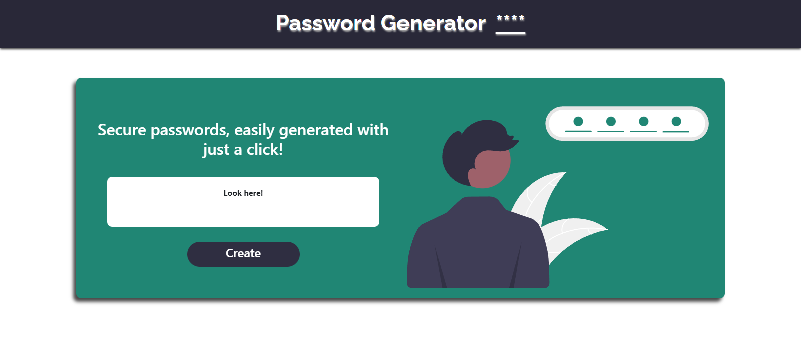

# Password Generator
## Description
This is a password generator web application that allows users to create a unique and secure password. The user can choose the length of the password and specify which types of characters to include (lowercase, uppercase, numeric, and special characters). The app will then generate a random password based on the user's preferences.

The motivation for this project was to provide a simple and convenient way for users to create strong passwords for their online accounts. With the increasing number of data breaches and cyber attacks, it is important for users to use strong and unique passwords for their online accounts. This app aims to make it easy for users to create and manage secure passwords.

https://nowinoa.github.io/Password-Generator/ 

## Table of Contents
- Installation
- Usage
- Credits
- License

## Installation
To run this app, follow these steps:

1. Download the project files from the repository.
2. Open the index.html file in your web browser.

## Usage
To use the password generator, follow these steps:

1. Open the index.html file in your web browser.
2. Specify the desired length of the password (between 10 and 64 characters).
3. Select which types of characters to include in the password (lowercase, uppercase, numeric, and special characters).
4. Click the "Generate Password" button to generate a new password.
5. The generated password will be displayed in the text box on the page. 

Here is a screenshot of the app:

## Credits
This project was built by Ainhoa Prada.

## License
This project is licensed under the MIT License. 

